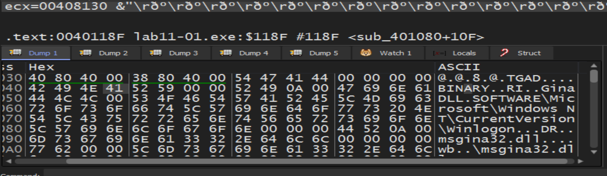

# Practical To Malware Analysis Book
## Chapter 11
## Lab 11-1

1- What does this malware drop to the disk?

- the malware dropes a file called msgina32.dll from a resource section called `TGAD`

2- How does the malware achieve persistance?

- by set `GinaDLL` in the registry location SOFTWARE\Microsoft\Windows NT\CurrentVersion\Winlogon\GinaDLL 

3- How does the malware steal user credentials?

- the malware steal credential using GINA interception
