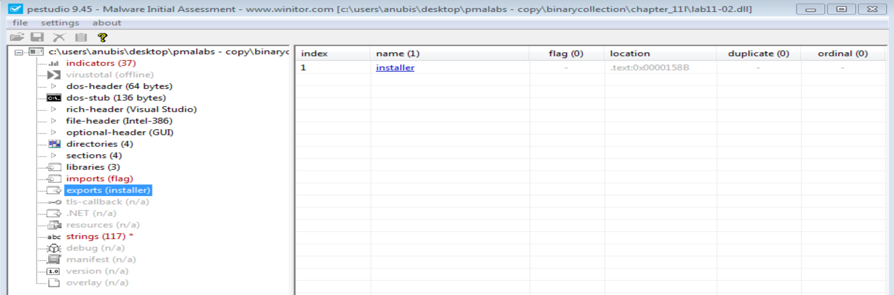
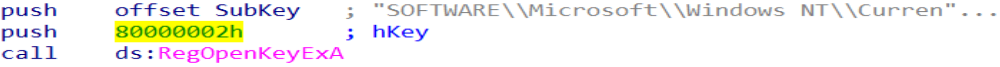
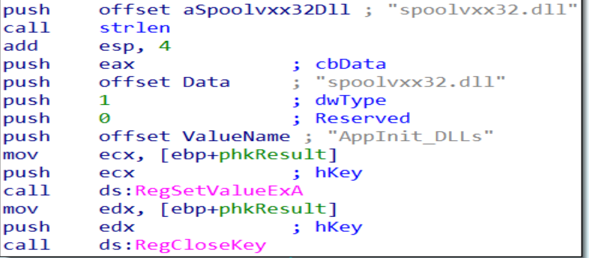
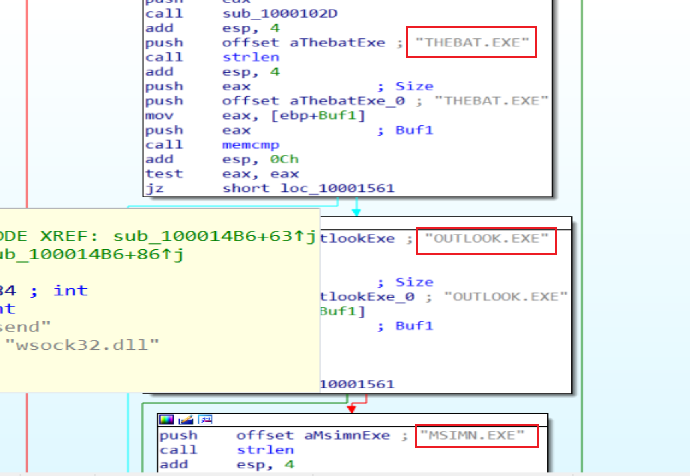
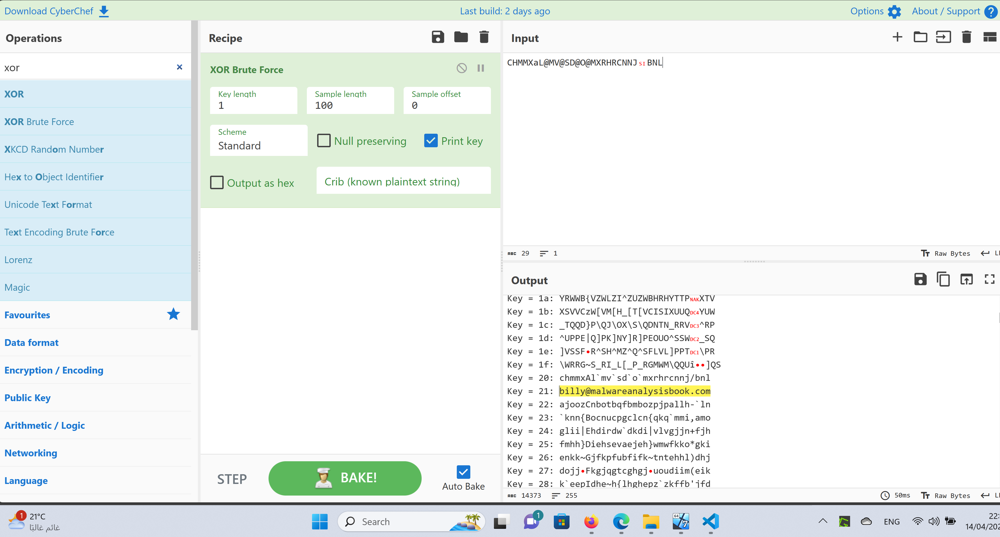

# Practical To Malware Analysis Book
## Chapter 11
## Lab 11-2

1- What are the exports for this DLL malware?

- the malware has one export  `installer`

2- what happens after you attempt to install this malware rundll32.exe? 

- the malware copied itself to the registry path SOFTWARE\Microsoft\Windows NT\CurrentVersion\Windows under AppInit_DLLs as spoolvxx32.dll 

3- Where must Lab11-02.ini reside in order for the malware to install properly?

Lab11-02.ini should reside in %SystemRoot%\System32\

4- How this malware installed for presistance?

- The malware installs itself in the AppInit_DLLs registry value

5- What user-space rootkit technique does this malware employes?

- the malware used inline rootkit in the send function

6- what is the hooking code do ?

- The hook checks if the outgoing packet is an email message containing `RCPT TO: ` and if this string is found, it adds an additional RCPT TO line containing a malicious email account

7- which processes does this malware attack and why?

- the malware targets "THEBAT.EXE" and "OUTLOOK.EXE" and "MSIMN.EXE" because all are email clients

8- What is the signhficance of the .ini file?

- the .ini file contain a encrypted email address after decoding it with XOR Brute Force, the result will be billy@malwareanalysisbook.com.
