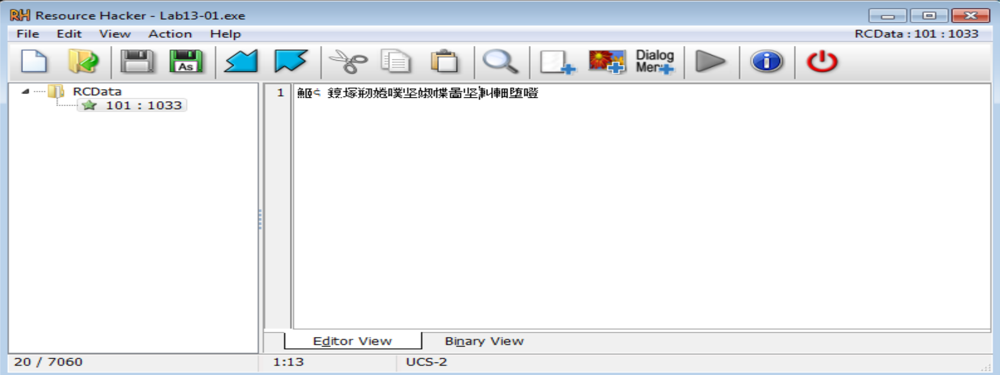
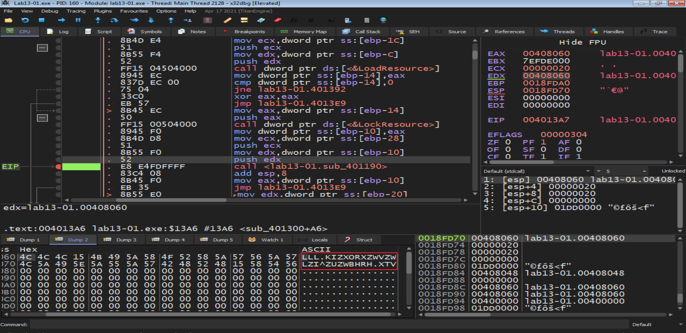
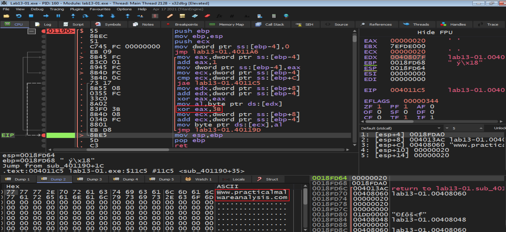
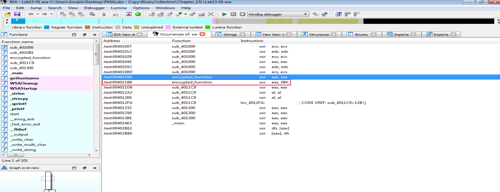
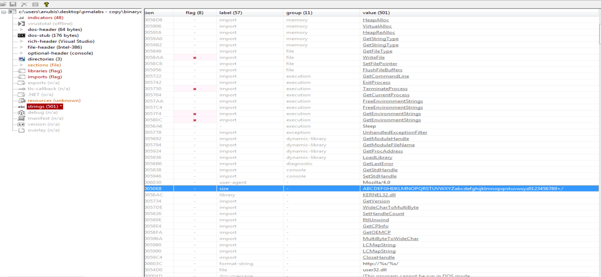

# Practical To Malware Analysis Book
## Chapter 13
## Lab 13-1

1-  The malware dropped an encrypted file called `101 : 1033` from resource section called `RCData` 

we will notice an encoded string pushed in the stack in EDX register  `LLL.KIZXORXZWVZWLZI^ZUZWBHRH.XTV` 

now we will get in the next suspicious function to trying to decode this suspicious string and the result will be: `www.practicalmalwareanalysis.com` to get resourse or something else from UserAgent Mozilla, so that is the website that malware communication with it.
 

and the type of decoding is `XOR` with key `3B`

Using Pestudio we will find encoded string with Base46 >> `ABCDEFGHIJKLMNOPQRSTUVWXYZabcdefghijklmnopqrstuvwxyz0123456789+/` >> the length of Base64 is `64-bit` and the Base64 function in disassembly is `sub_4010B1`

- Padding characters may be used if the hostname length is less than 64-bits and not evenly divisible by 3