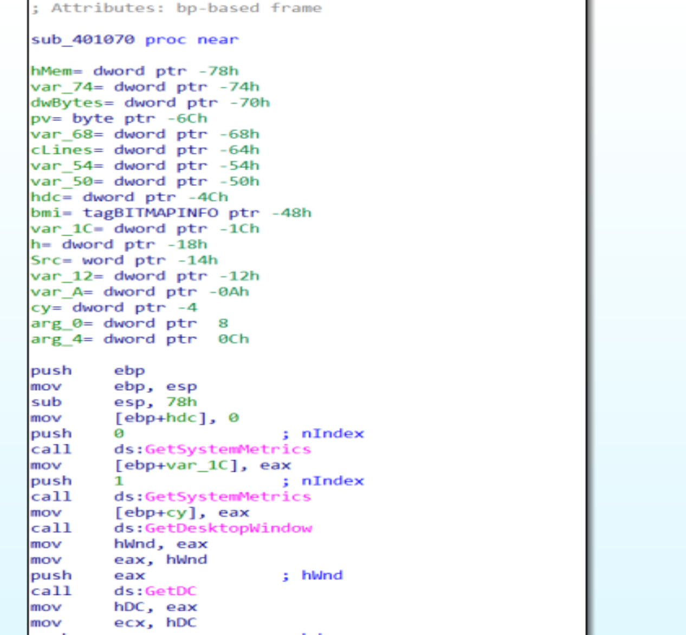
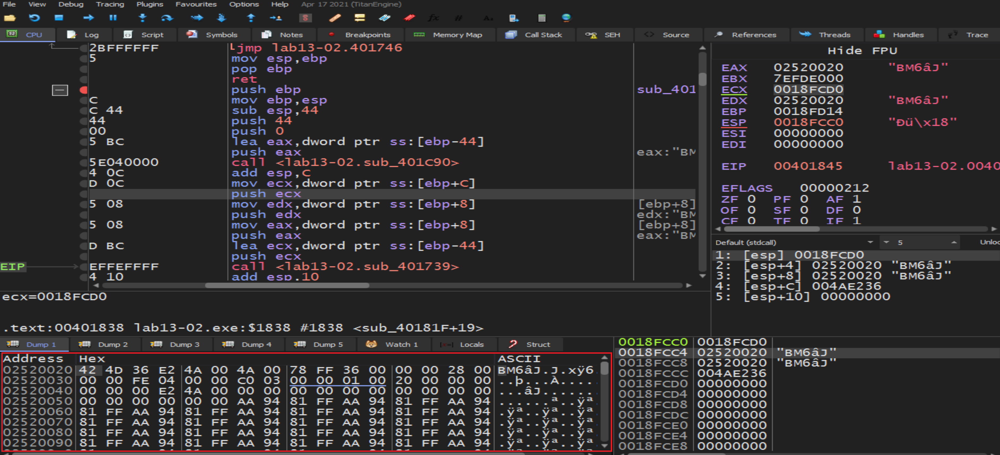
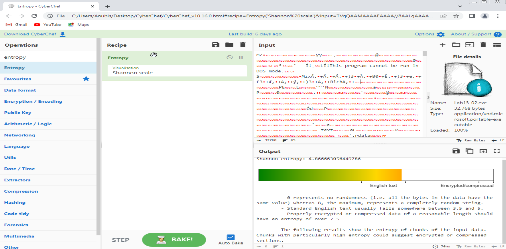
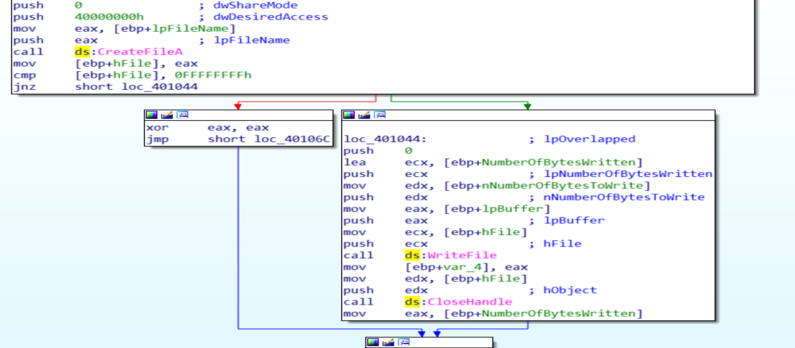
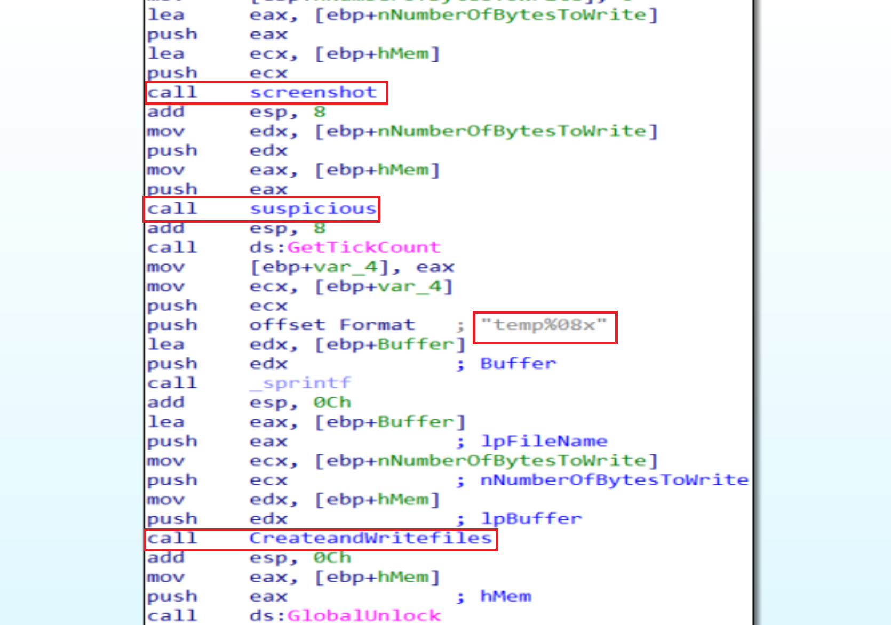

# Practical To Malware Analysis Book
## Chapter 13
## Lab 13-2

the malware creates large numbers of file each 5 seconds with format string `temp%08x` with 8 hexadecimal digits

- this function creates a screanshots we can notice it by the functions in front of us

- if we are locking in ECX Register in hex dump before calling the encrypted function we will notice a magic bytes starts with BS6 that looks likes png or some thing like images now we will copy this binary and put it into file with extension bmp to see the screenshot before decoding it  

- if we put the file in cyberchef to see the entropy we will see big entropy and that says to us that this malare has an encrypted thing

- we have intersted functions like createfile and writefile.
The encoding functions might be found just before the call to WriteFile because the malware will use the encryption to encrypt the photo and write it into a file then but before this he will puts the names of files by hexadecimal style and make one by one every 5 seconds by different names.

