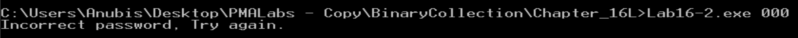

# Practical To Malware Analysis Book
## Chapter 16
## Lab 16-2

1- What happens when you run Lab16-02.exe from the command line ?

2- 1- What happens when you run Lab16-02.exe and guess the command line parameter?

