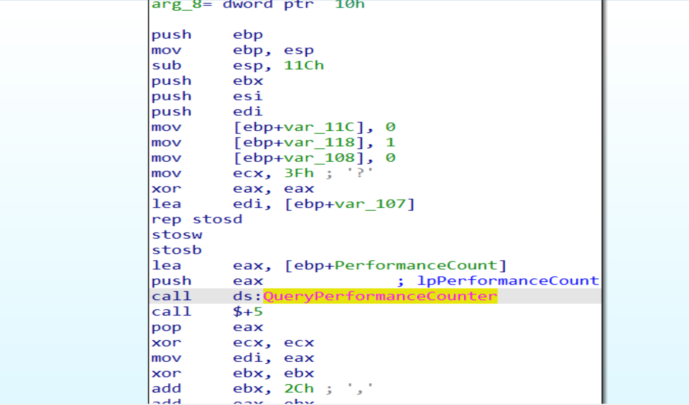
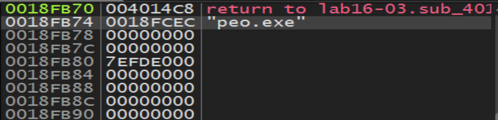

# Practical To Malware Analysis Book
## Chapter 16
## Lab 16-3

1- Which strings do you see when using static analysis on the binary?
----

- we have a suspicious import strings and functions like `WriteFile`, `ShellExecute`, `cmd`, `cmd.exe`, `/c del`

in IDA Pro we will notice an API calling to `Query performanceCouter` searching for an anti-debugging Technique.

2- what happens when you run this binary?
-----

- When you run this malware, it appears to do nothing other than
terminate.

3- How must you rename the sample in order for it to run properly?
-----
- peo.exe

4- Which anti-debugging techniques does this malware employ?
-----

- Each of the anti-debugging techniques are used to measure time delays caused by the debugger. They use pairs of instructions to get a timestamp, do something, take a second timestamp, and then compare the timestamp difference. If the difference is beyond a specified threshold, a debugger could be slowing down execution.

First, it uses `QueryPerformanceCounter` calls at 40121D and 401271 during the filename check.

Second, it uses `GetTickCount` calls at 401584 and 401595 during network initialization.

Third, it uses `rdtsc` instructions at 401323 and 40136D, during generation of the domain name.

5- For each technique, what does the malware do if it determines it is running in a debugger?

- Each does something different to stop analysis.

If the `QueryPerformanceCounter` check detects the debugger, the malware will manipulate the filename string to return qgr.exe as the name to check against. If the program is renamed to qgr.exe it will not execute.

If the `GetTickCount` check detects the debugger, the malware will try to write data to memory address 00000000, causing an access violation and crashing the program at 4015B4.

If the `rdtsc` check detects the debugger, the malware will try to delete itself on the command line with a call to function 4010E0.

6- Why are the anti-debugging techniques successful in this malware?

- The anti-debugging techniques are successful because debuggers add overhead to program execution, causing time delays. These delays are large enough to be detected via the techniques used in this sample. Even when passing all exceptions in Immunity, the program still detects a debugger.

7- What domain name does this malware use?

- `adg.malwareanalysisbook.com` is the domain name that this sample connects to.

