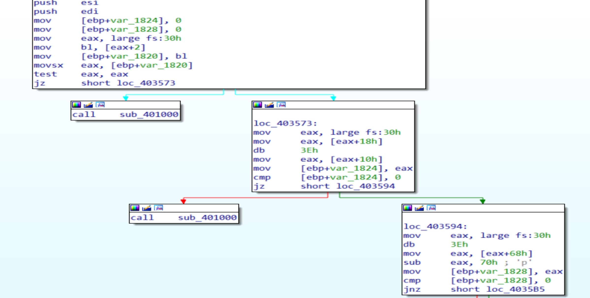
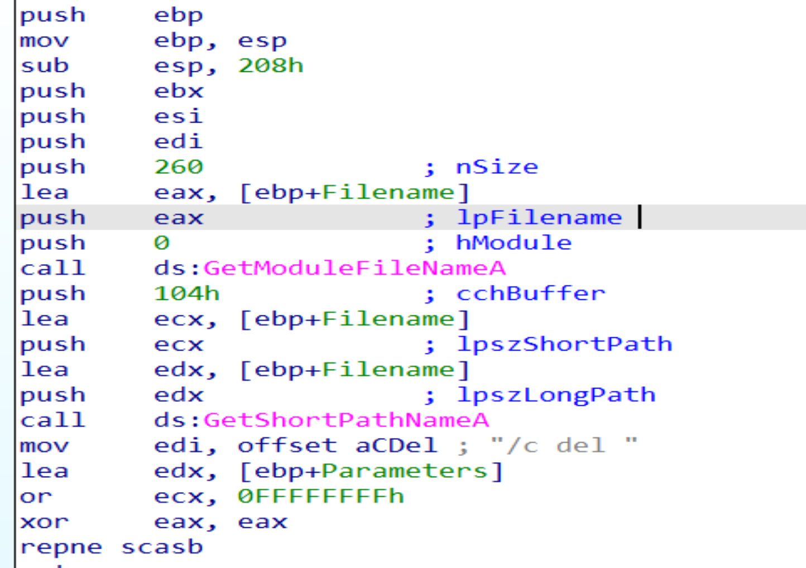
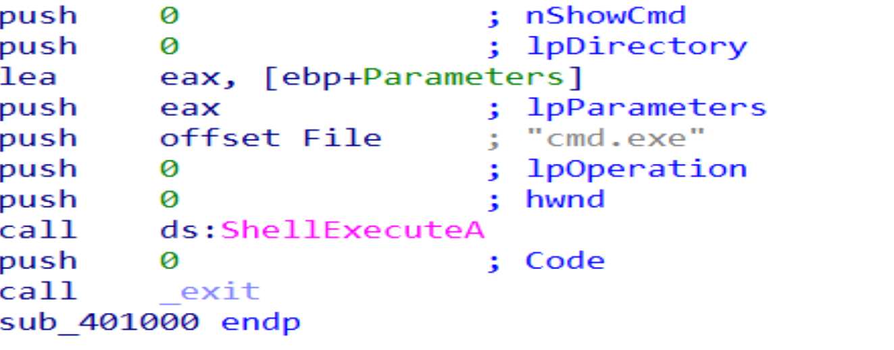
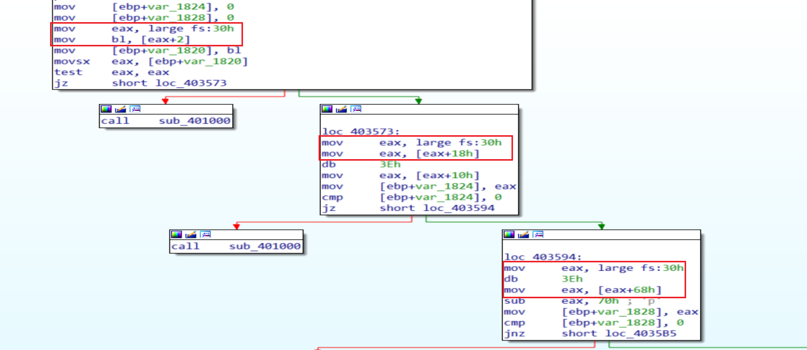
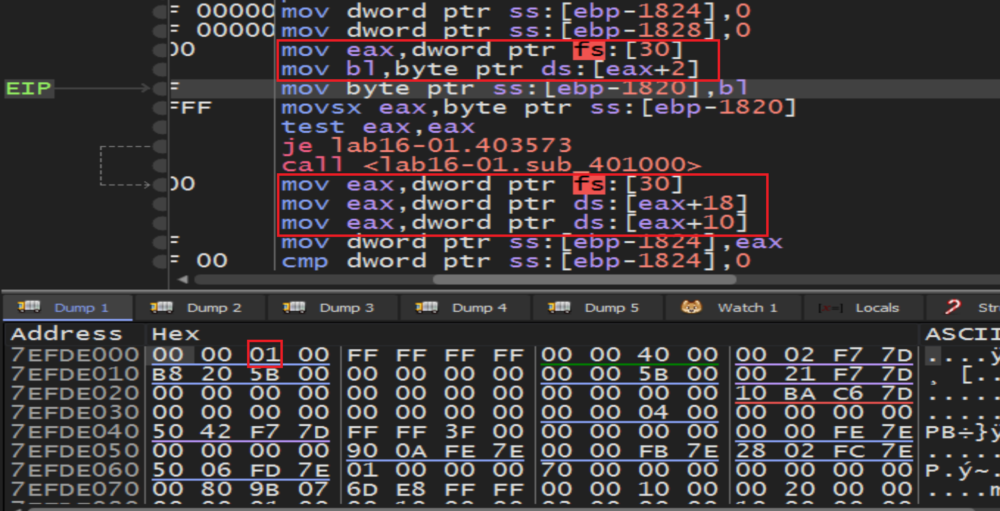
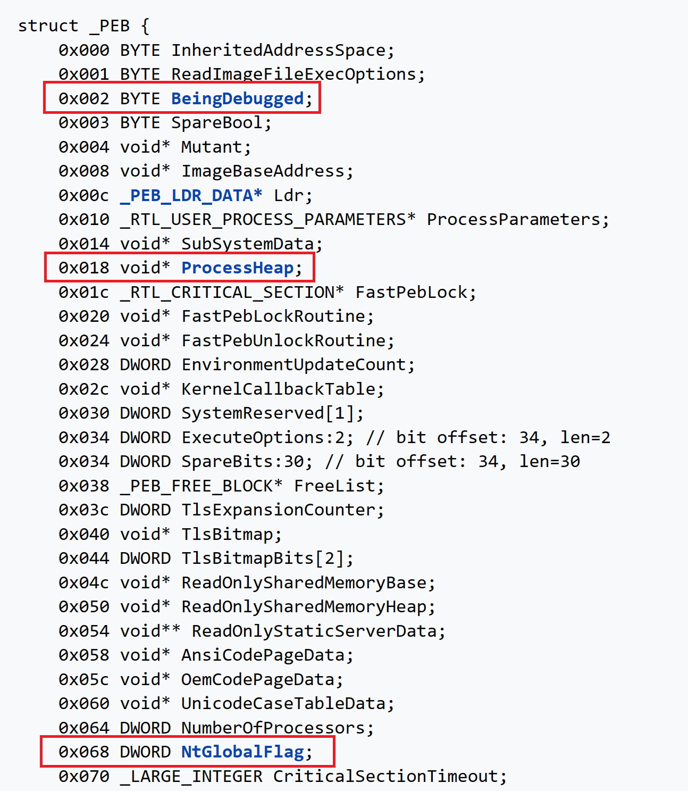

# Practical To Malware Analysis Book
## Chapter 16
## Lab 16-1

1- Which anti-debugging Technique does this malware employ?

- First we will notice two statements the second one is calling a function but without return function, so i think it a suspicious function we can get in to see it activity

 

2- if the malware detected a debugger activity will open `cmd.exe` and run  `/c del Lab16-01.exe` then will delete it self from the hard and calling exit to terminate itself.

 

 
 
 - here it is we will notice a PEB Structure that indicate to an anti-debugging technique is there.we will notice a parameters for PEB like `[eax+2]` and `[eax+18h]` and `[eax+68h]` in this link we will find most PEB Structure parameters: https://www.aldeid.com/wiki/PEB-Process-Environment-Block#:~:text=The%20Process%20Environment%20Block%20%28PEB%29%20is%20a%20user-mode,debugged%2C%20find%20image%20base%20address%20of%20imported%20DLLs%2C

 

 we have `BeingDebugged` flag at offset 2 in the PEB structure is set to 1

 
- so the anti-debugging techniques used in this malware is `BeingDebugged`, `ProcessHeap`, `NtGlobalFlag` to check if the program is running under debugger or not 

 

3- we can manually change the jump flags in X32 Debugger during runtime or used `sylla hide` plugin

5- Both the OllyDbg plug-in PhantOm and the ImmDbg PyCommand
hidedebug will thwart this malware’s checks.